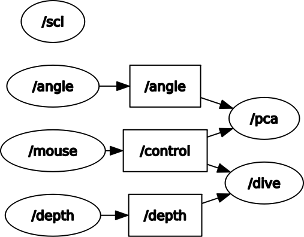
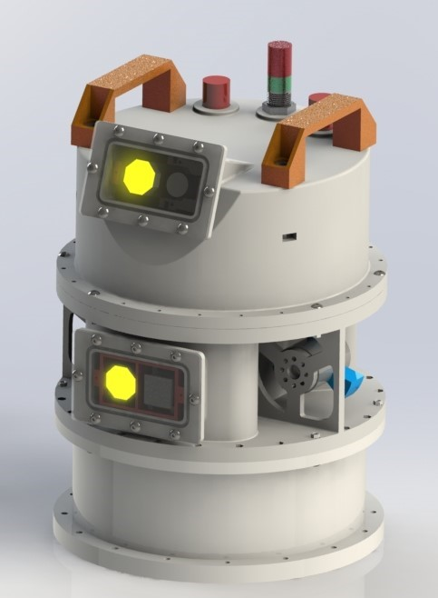
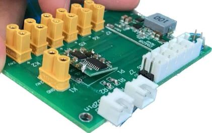

# eimo

## Package Description
| Package name     | Description                                                                                   | Scripts                                                                    | Dependency                                |
|------------------|-----------------------------------------------------------------------------------------------|----------------------------------------------------------------------------|-------------------------------------------|
| eimo_msgs        | Control, Depth, Angle.                                                                        | depth_ms5837.py<br/>mouse_multi.py<br/>witsensor.py<br/>request_voltage.py | ms5837<br/>pyspacemouse<br/>libhidapi-dev |
| pac9685          | Light, Propeller.                                                                             |                                                                            | pigpio<br/>simple_pid<br/>                |
| scl_passthrough  | Passthrough for Moons step servo Motor; Provide Depth, Voltage.                               | diving.py<br/>srv: serial_passthrough.py                                   | serial                                    |
| witprotocol      | Provide Angle.                                                                                |                                                                            | serial                                    |

## Rosnode Description



## Roslaunch Description

| Roslaunch Name                                                          | Description                                                                                                                                    | ~/.bashrc                                                                                                                                                                   | Machine |
|-------------------------------------------------------------------------|------------------------------------------------------------------------------------------------------------------------------------------------|-----------------------------------------------------------------------------------------------------------------------------------------------------------------------------|---------|
| [eimo.launch](eimo_msgs/launch/eimo.launch)                             | robot will wait for control                                                                                                                    | source /opt/ros/noetic/setup.bash <br/>source /home/ubuntu/eimo_remote/devel/setup.sh <br/>export ROS_MASTER_URI=http://192.168.31.16:11311<br/>export ROS_IP=192.168.31.16 | remote  |
| [mouse.launch](eimo_msgs/launch/mouse.launch)<br/>(include eimo.launch) | robot will be controlled<br/>Attention: <br/>Copy [eimo.sh](eimo_msgs\scripts\eimo.sh)  to /home/ubuntu/eimo.sh<br/>Be sure roscore is running | source /opt/ros/noetic/setup.bash <br/>source /home/zngz/eimo_ws/devel/setup.sh <br/>export ROS_MASTER_URI=http://192.168.31.16:11311<br/>export ROS_IP=192.168.31.236      | local   |


## Service
```bash
#cat /etc/systemd/system/clash.service
[Unit]
Description=A rule-based tunnel in go
After=network-online.target
[Service]
Type=simple
User=root
UMask=007
ExecStart=/opt/clash/clash-linux-amd64-v1.11.8 -d /opt/clash/
Restart=on-failure
RestartSec=1
# Configures the time to wait before service is stopped forcefully.
TimeoutStopSec=300
[Install]
WantedBy=multi-user.target
```

```bash
#cat /etc/systemd/system/pigpiod.service
[Unit]
Description=Daemon required to control GPIO pins via pigpio
After=remote-fs.target
After=syslog.target
After=network.target
After=systemd-user-sessions.service
[Service]
Type=forking
User=root
UMask=007
ExecStart=/usr/local/bin/pigpiod
ExecStop=/bin/systemctl kill pigpiod
[Install]
WantedBy=multi-user.target
```

```bash
#cat /etc/systemd/system/eimo.service
[Unit]
Description=start eimo_remote
After=remote-fs.target
After=syslog.target
After=network.target
After=systemd-user-sessions.service
After=pigpiod.service
[Service]
Type=forking
User=ubuntu
UMask=007
ExecStart=/home/ubuntu/ros_autoRun.sh
[Install]
WantedBy=multi-user.target
```

```bash
# cat /etc/systemd/system/camera.service
[Unit]
Description=start gstreamer
After=remote-fs.target
After=syslog.target
After=network.target
After=systemd-user-sessions.service
[Service]
Type=simple
User=root
UMask=007
ExecStart=/home/ubuntu/camera.sh
[Install]
WantedBy=multi-user.target
```

```bash
# cat /etc/systemd/system/roscore.service
[Unit]
Description=start roscore
After=remote-fs.target
After=syslog.target
After=network.target
After=systemd-user-sessions.service
[Service]
Type=idle
User=ubuntu
UMask=007
ExecStart=/home/ubuntu/roscore.sh
Restart=on-abort
[Install]
WantedBy=multi-user.target
```

## Robot Description



### Counterweight Details

```
                                      1                                
                           <--------------------->                     
                         /-                       -\                   
               3      /--                           --\    3.1         
                   /--                                 --\             
                 /-                                       -\           
              /--                                           --\        
            --                                                 --      
            ^                                                   ^          
            |                                                   |      
            |                                                   |      
         1  |                                                   |  1   
            |                                                   |        
            |                                                   |      
            v                                                   v      
            --                                                 --      
              \-                                            --/        
                \--                                       -/           
                   \--                                 --/             
              5       \-                            --/    5           
                        \-                        -/                   
                           <--------------------->                     
                                     3.5                                

                              # robot: 5.466kg
                              # total: 6.445kg
                           # counterweight: 0.979kg
                     # details: 1, 3.1, 1, 5, 3.5, 5, 1, 3
                     # 22*40+6*5+19*0.64+2.8*6+4.0*10=979.0g
                     # 40g: 1+3+1+5+3+5+1+3=22; 22*40=880
                     # 5g: (0.1+0.5)*10=6; 6*5=30
                     # M4: 1.7g; 19*0.64=12.16
                     # M4x22 2.8; 2.8*6=16.8
                     # M4x40 4.0; 4.0*10=40
```

## Hardware Description

```
                         +-----------+             +-----------+                                             
                         |Three-phase|             |   Motor   |                                             
                         | Motor x 2 |             +-----^-----+                                             
                         +-----^-----+                   |                                                   
                              24V                     SCL+24V                                                
                               |                         |                                                   
+--------------+         +-----------+                   |                                                   
|              |         |  ESC x 2  <------------------------------PWM+Ground--------------------------+    
|              |         +-----------+           +-------|-------+                                      |    
|   Battery    |               ^                 |  Step Motor   |                +-----------+         |    
|              |               |                 |   Driver      <--232+Ground----> 232<->TTL |         |    
|              |               |   +----24V------>               |                +-----^-----+         |    
+---^------|---+              24V  |             |---------+     |                      |               |    
    |      |                   |   |      +------> Limiter |--------GPIO-----+       TTL+5V             |    
    |     24V                  |   |     5V      |         |     |           |          |               |    
    |      |                   |   |      |      +---------------+           |          |               |    
    |    +-v--------+        +-|-----------------+                      +----v----------v----+          |    
    |    |          |        |                   |                      |                    |      +-------+
    |    |  Relay   | --24V->|                   |----------5V--------->|     Raspi          <-I2C-->PCA9685|
    |    |          |        |  24        24->5  |                      |                    | 3.3V +-^-----+
    |    +----------+        |                   |                      +-----+              |        | |    
    |                        |    Break Board    |----------5V--------->| FAN |              |        | |    
    |                        +-------------------+                      +-----+-^----------^-+        | |    
    |                          |            |                                   |          |          | |    
    |                          |            +---------------5V----------------------------------------+ |    
    |                          |            |                                  TTL      I2C+3.3V        |    
    |                         24V           |                                   |          |            |    
    |                          |            |                               +--------+ +---v----+       |    
    |                          |            +---------------5V------------->|  JY61  | | MS5837 |       |    
+--------+                +----------+                                      +--------+ +--------+       |    
| Charge |                |Light x 2 <-----------------------------PWM+Ground---------------------------+    
+--------+                +----------+                                                                       
```
### Break Board

